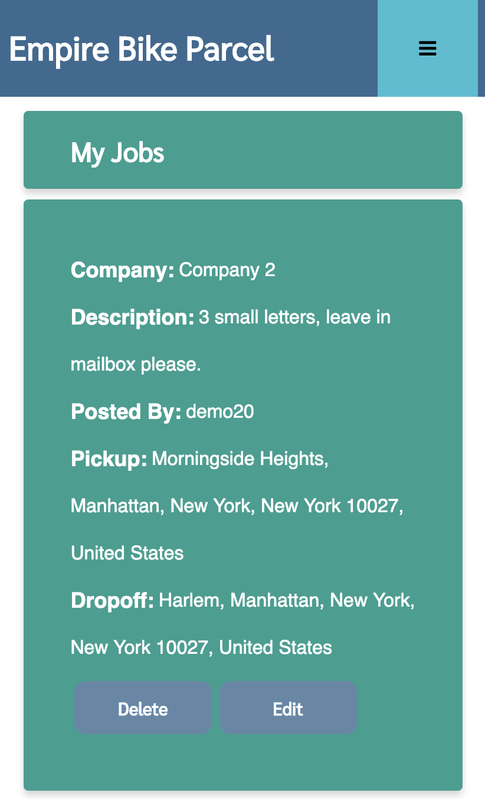

## Empire Bike Parcel

A delivery based app that gives businesses a platform to post delivery jobs with a map view and autocomplete addresses.  

This is a full stack app with user authentication, user endpoints, and allows CRUD operations for the jobs (create, read, update, delete).

Tests were also preformed on all of the endpoints.

## Built with:

Backend:		User Auth:				Testing:		FrontEnd:

-Express		-Bcryptjs				- Chai			-jQuery
-Mongoose		-JSON Web Token (JWT)			-Chai-HTTP		-AJAX
-Morgan			-Passport				-Mocha			-MapBox
-MongoDB		-Passport-JWT				-Travis			-JavaScript
-mLab			-UUID					-Faker			-HTML / CSS
											-Heroku

## Demo

- [Live Demo]https://empirebikeparcel.herokuapp.com/

## Screenshots
Main Page:

Register:

Login:

User Homepage:

Add Delivery:

Edit Delivery:

Mobile Version:

