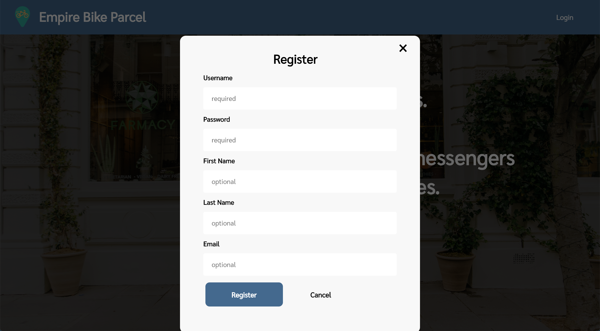
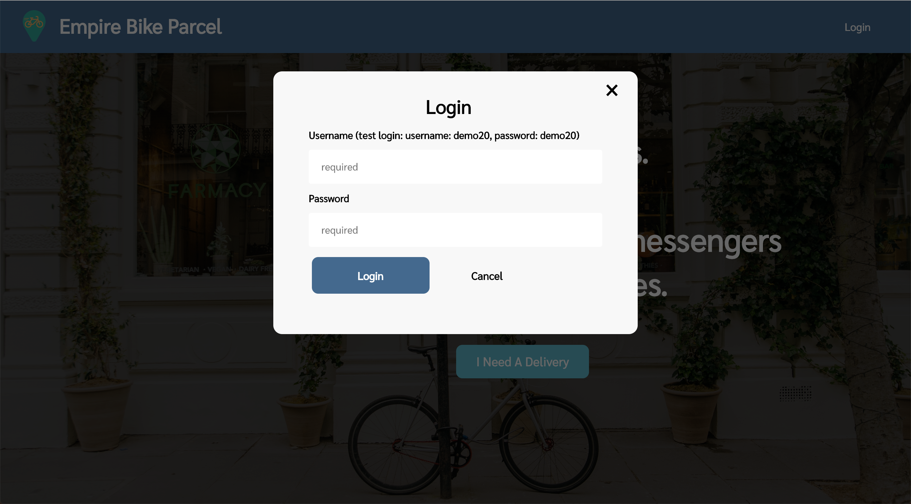
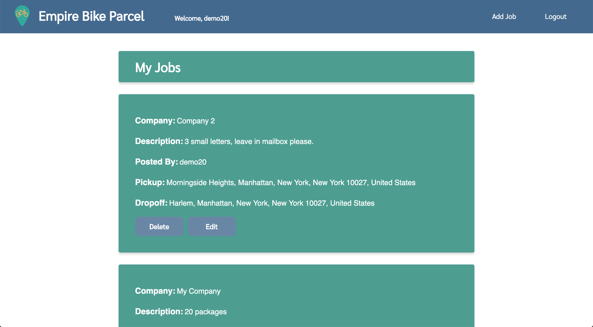
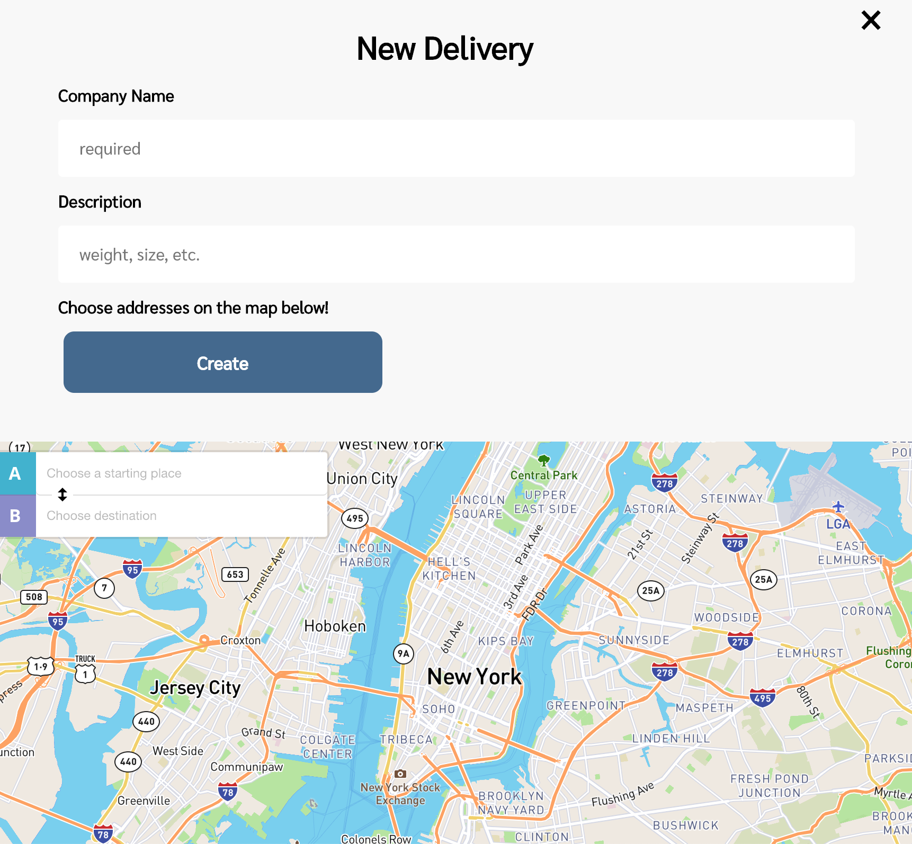
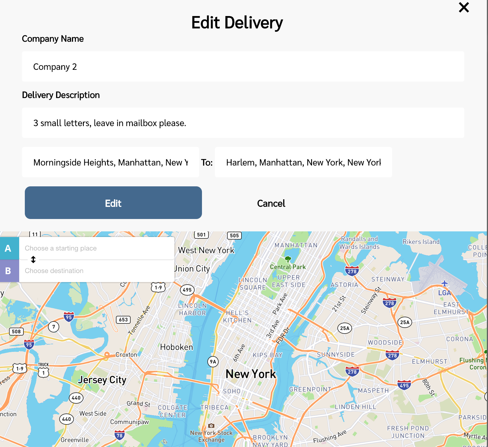

## Empire Bike Parcel

A delivery based app that gives businesses a platform to post delivery jobs with a map view and autocomplete addresses.  

This is a full stack app with user authentication, user endpoints, and allows CRUD operations for the jobs (create, read, update, delete), and is mobile friendly.

Tests were also preformed on all of the endpoints.

## Demo

- [Live Demo]https://empirebikeparcel.herokuapp.com/

## Built with:

FrontEnd:
- jQuery
- AJAX
- MapBox
- JavaScript
- HTML / CSS
- Heroku

Testing:
- Chai	
- Chai-HTTP	
- Mocha
- Travis
- Faker	

User Auth:
- Bcryptjs
- JSON Web Token (JWT)	
- Passport	
- Passport-JWT
- UUID	

Backend:
- Express								
- Mongoose				
- Morgan							
- MongoDB							
- mLab									 
	
## Screenshots
Main Page:

Register:

Login:

User Homepage:

Add Delivery:

Edit Delivery:

Mobile Version:

